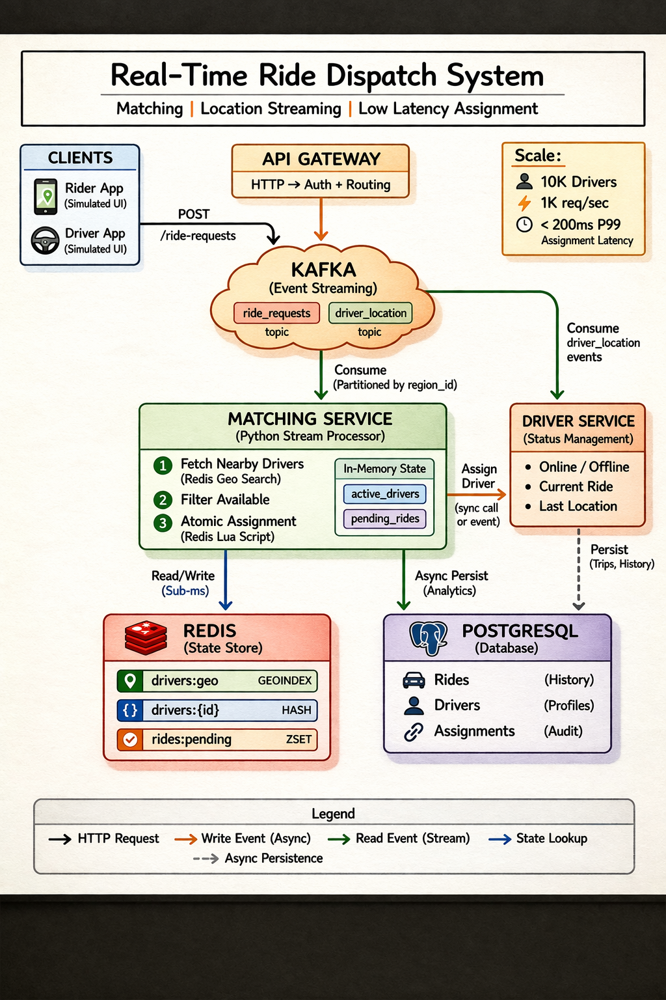

# Ride Dispatch System

Real-time ride matching system. A rider requests a trip, the nearest available driver gets assigned under 200ms.

Built as my M.Sc. Data Science major project.



## Stack

- **Kafka** - event streaming for ride requests and driver location updates
- **Redis** - geospatial driver index, ride state, assignment results
- **Python + Flask** - stream processor and REST API
- **PostgreSQL** - ride history and driver profiles
- **React + Leaflet.js** - live map frontend
- **Prometheus + Grafana** - metrics and dashboards
- **Docker Compose** - runs everything locally

## How it works

Rider submits a pickup location. The stream processor queries Redis for nearby available drivers, picks the nearest one, and atomically assigns them using a Lua script to prevent double-booking. Flask returns a `ride_id` immediately and the rider polls for the result.

Driver positions stream in from Kafka every 5 seconds and update the Redis geo index.

## Project structure

```
stream-processor/    matching engine, Kafka consumers, Redis + PostgreSQL writes
api-server/          Flask REST API, Kafka producer
event-generator/     synthetic rider and driver simulation
frontend/            React + Leaflet.js live map and admin dashboard
migrations/          PostgreSQL schema
observability/       Prometheus config
tests/               unit and integration tests
load-tests/          k6 load test script
```

## Docs

- [Architecture and design decisions](docs/architecture.md)
- [API reference](docs/API.md)
- [Setup guide](docs/SETUP.md)

## Running locally

```bash
git clone https://github.com/SivaPrasath26/ride-dispatch-system.git
cd ride-dispatch-system
docker compose up -d
./scripts/create_topics.sh
```

API runs at `http://localhost:5000`, frontend at `http://localhost:3000`, Grafana at `http://localhost:3001`.