# Architecture

## System Overview

Event-driven architecture with a streaming backbone, an in-memory geospatial state store for low-latency matching, a relational database for persistence, and a Flask REST API for serving.

The write path (event ingestion and state updates) is fully decoupled from the read path (assignment serving). Redis is the source of truth for all live operational state. PostgreSQL only stores historical records and is never in the critical matching path.

---

## High Level Architecture

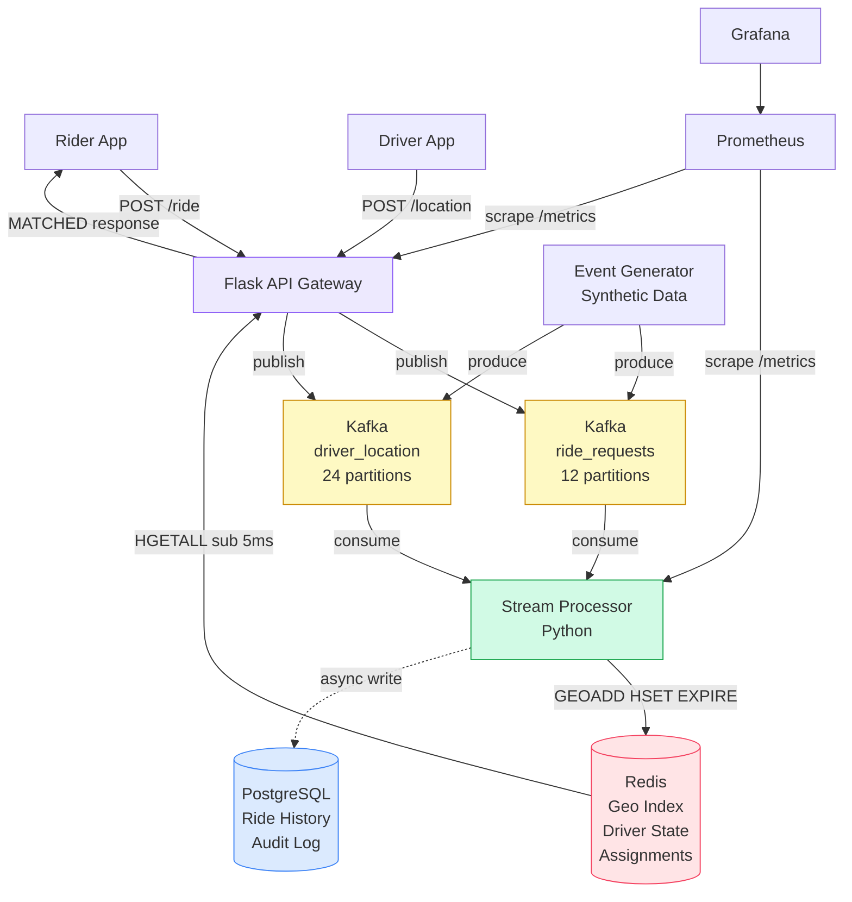

---

## Write Path - Ride Request

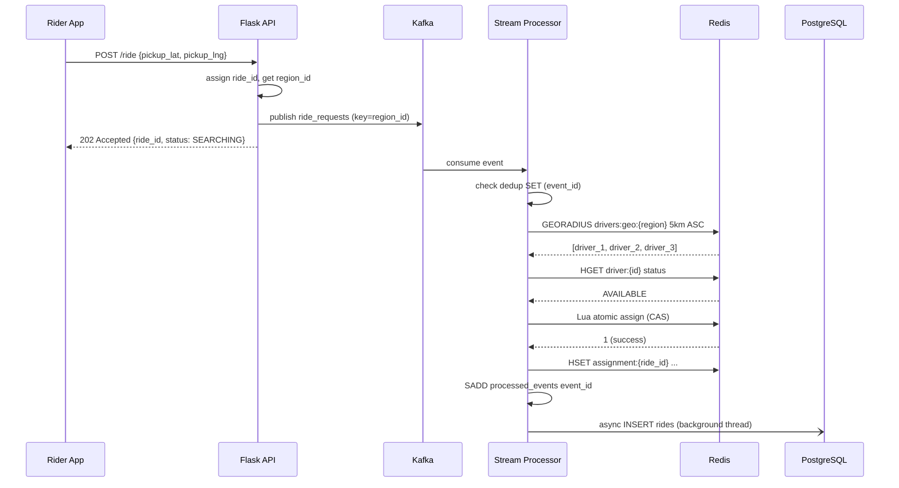

---

## Read Path - Assignment Polling

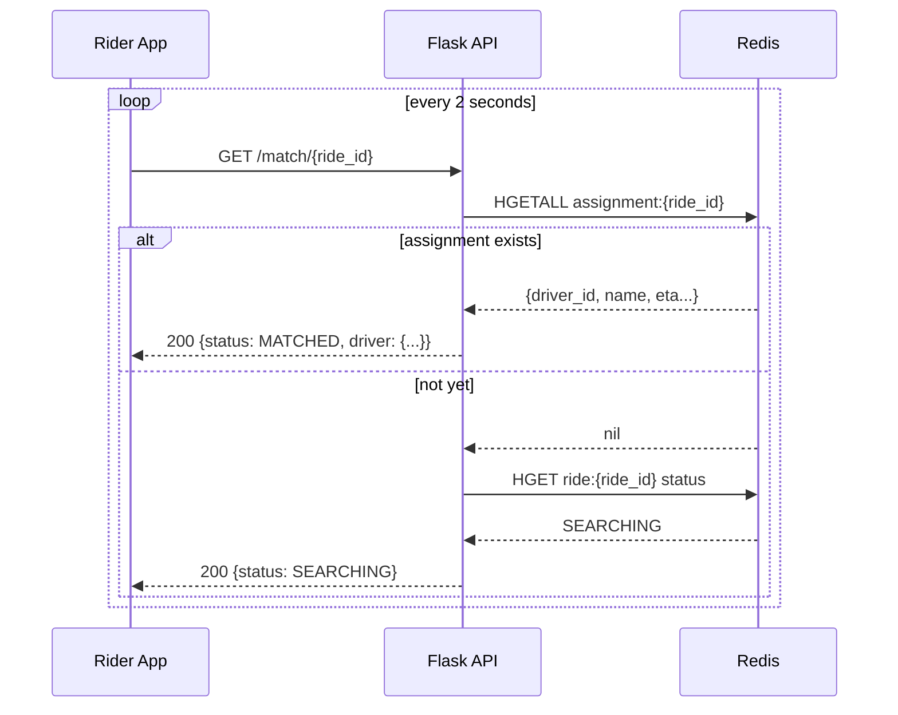

---

## Write Path - Driver Location Update

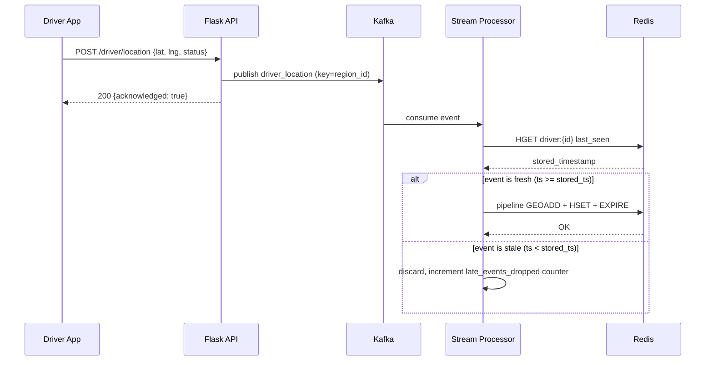

---

## Atomic Assignment - Race Condition Prevention

Two processors receiving requests near the same driver simultaneously:

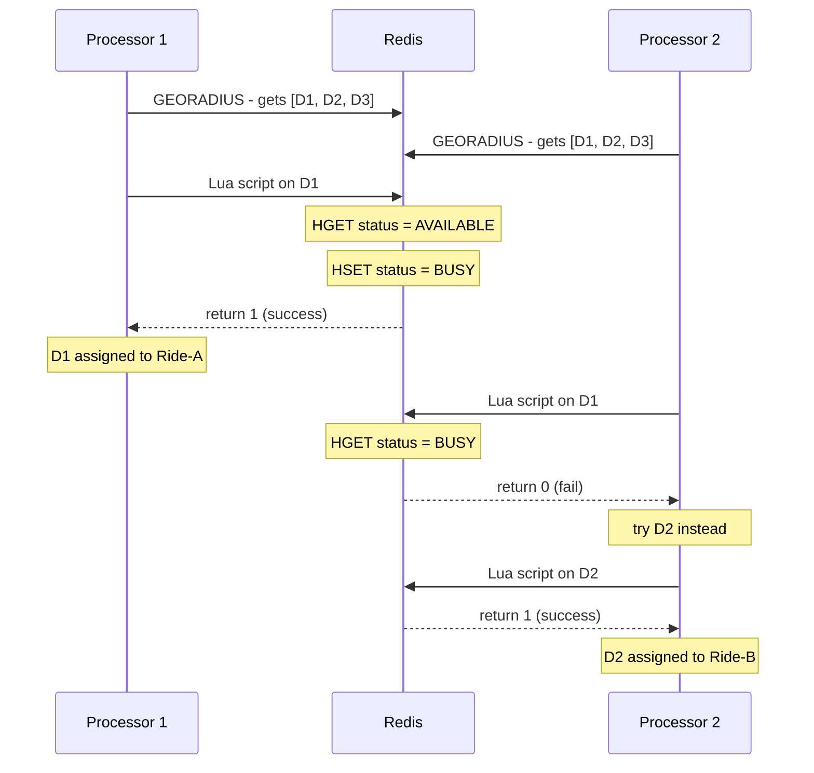

Lua script runs atomically - no other Redis client can interleave. Zero double-assignment guaranteed.

---

## Driver State Machine

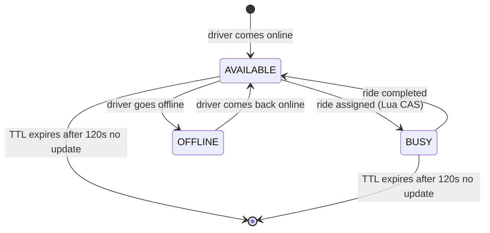

---

## Ride Lifecycle

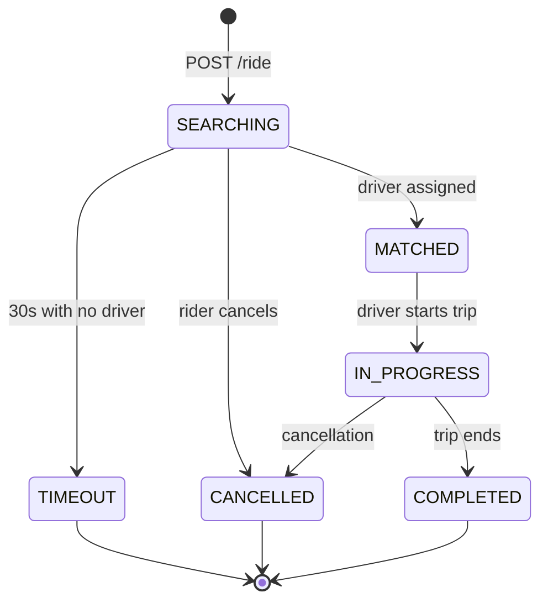

---

## Retry Strategy - No Driver Found

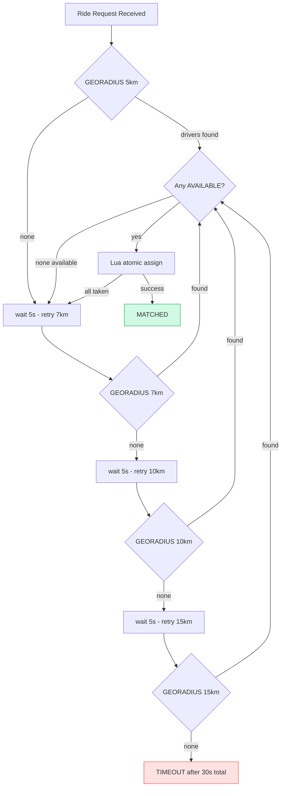

---

## Kafka Design

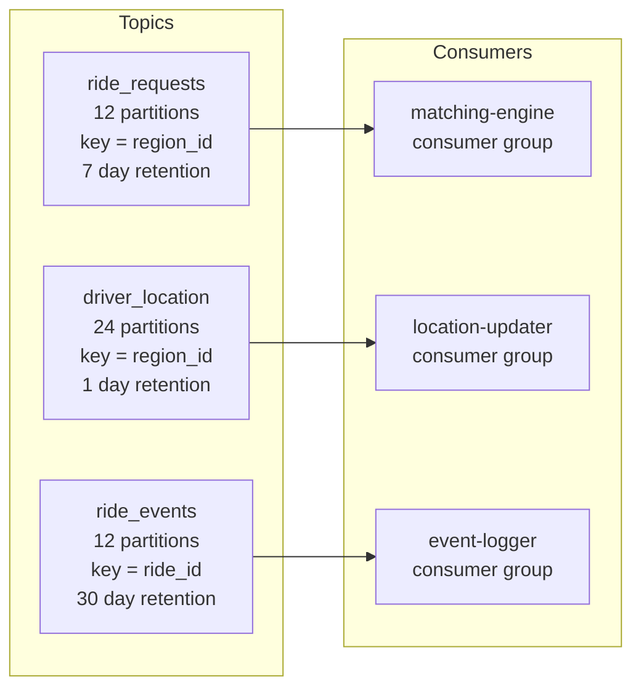

Partitioning by `region_id` means all events for the same city region land on the same partition. One processor instance owns all matching state for its region with no cross-partition coordination needed.

---

## Redis Data Structures

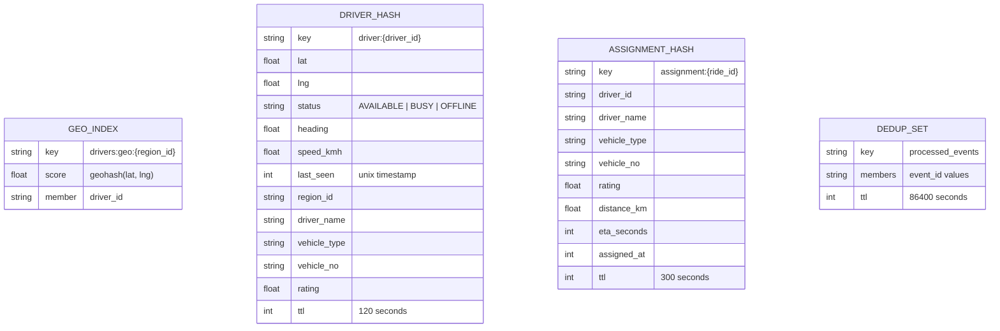

---

## PostgreSQL Schema

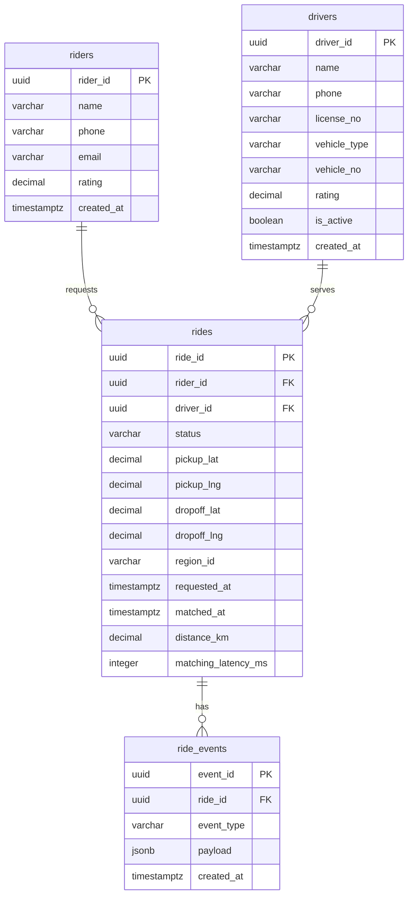

---

## Key Design Decisions

| Decision | Choice | Why |
|---|---|---|
| State store | Redis geospatial sorted sets | Sub-ms GEORADIUS vs 5-20ms PostGIS |
| Kafka partition key | `region_id` | All same-region events on one partition, no cross-partition joins |
| Atomic assignment | Redis Lua script | All operations atomic, no external lock manager needed |
| Offset commit | Manual after Redis write | Safe crash recovery, no lost events |
| Deduplication | Redis SET with 24h TTL | O(1) lookup, prevents double-processing on re-delivery |
| Late events | Timestamp comparison | Prevents stale location overwriting latest position |
| PostgreSQL writes | Async background thread | Removes DB from critical path, Redis is source of truth |
